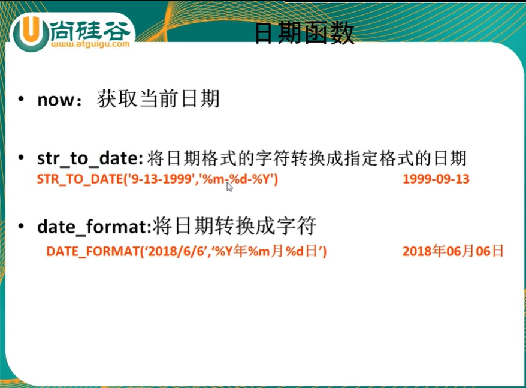
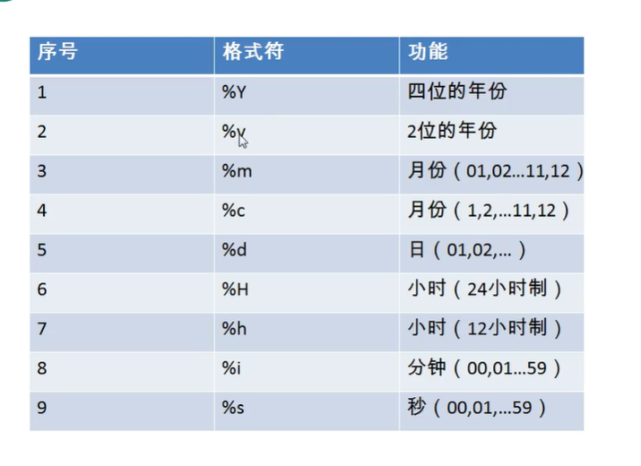

# 常见函数

+ 调用: select 函数名(实参列表) [from 表];

+ 特点:
  + 叫什么(函数名)
  + 干什么(函数功能)
+ 分类: 
  + 单行函数
    + 如 concat, length, ifnull等 (传入一个参数返回一个值)
  + 分组函数 (传入一组参数返回一个值)
    + 功能: 做统计使用, 又称统计函数, 聚合函数, 组函数
  + 基本类型: 
    + 字符函数
    + 数学函数
    + 日期函数
    + 其他函数(补充)
    + 流程控制函数(补充)

## 单行函数

### 1.字符函数

1. length 获取参数值的字节个数

   + SELECT LENGTH('zyf')

2. concat 拼接字符串

   + SELECT  CONCAT(last_name, '_', first_name) 姓名 FROM employees

3. upper, lower, 转大小写

   + SELECT UPPER('john')
   + SELECT LOWER('john')

4. substr, substring 截取字符串, sql中索引从1开始

   + SELECT SUBSTR('李莫愁爱上了陆展元', 7) 

5. instr 返回字串第一次出现的索引, 未找到返回0

   + SELECT INSTR('蕾姆爱上了莱月昂', '莱月昂') out_put

6. trim 清除/替换字符串两端字符

   + SELECT TRIM('      miku       ')

   + SELECT TRIM('aa' FORM 'aaaaa荒木aaaaa')

7. lpad 用指定的字符实现左填充指定长度

   + SELECT LPAD('芽衣子', 2 ,'*') AS out_put

8. rpad 用指定的字符实现右填充指定长度

   + SELECT RPAD('芽衣子', 2 ,'*') AS out_put

9. replace 替换

   + SELECT REPLACE('蕾姆蕾姆拉姆拉姆蕾姆蕾姆蕾姆', '蕾姆', '亚丝娜')

### 2.数学函数

1. round 四舍五入(第二个参数,保留小数点位数)
   + SELECT ROUND(1.553, 2) 
2. ceil 向上取整, 返回>=该参数的最小整数 
3. floor 向下取整
4. truncate 截断 将多余的小数位数去除
   + SELECT TRUNCATE(1.3458, 1)
5. mod 取余 (a - a / b * b)
   + SELECT MOD(10, 3); 
   + SELECT 10 % 3 

### 3.日期函数

1. now 返回当前系统日期 + 时间

2. curdate 返回当前系统日期, 不包含时间

3. currtime 返回当前时间, 不包含日期

4. 可以获取指定的部分, 年, 月, 日, 小时, 分钟, 秒

   + YEAR() 年, MONTH() 月/ MONTHNAME() 英文月, .........

5.  DATEDIFF() 求两个日期的相差时间

6. 

   

### 4.其他函数

1. SELECT VERSION();查看版本
2. SELECT BATABASE(); / SELECT BATABASES(); 查看数据库
3. SELECT USER() ; 当前用户
4. password('字符'):  返回该字符的密码形式
5. md5('字符'): 返回该字符的MD5加密形式


### 5. 流程控制函数

1. if(函数): if else 的效果

   + SELECT IF(10 > 5, '大', '小') ==>大

2. case函数 :

   + switch case 效果

     + ```
       case 要判断的字段或表达式
       when 常量1 then 要显示的值1或语句1(如果是语句要加分号)
       when 常量2 then 要显示的值2或语句2
       ....
       else 要显示的值n或语句n
       end
       ```

   + 类似于多重if

     ```
     case 
     when 语句 then 要显示的值1或语句1(如果是语句要加分号)
     when 语句2 then 要显示的值2或语句2
     ....
     else 要显示的值n或语句n
     end
     ```

## 分组函数

### 1.分类

+ 用于计算一列中的值

1. sum 求和
2. avg 平均值
3. max 最大值
4. min 最小值
5. count 计算非空值个数

### 2. 支持类型

1. SUM(), AVG() 支持数值型
2. MAX(), MIN(), COUNT() 任何类型
3. 以上函数都忽略null值

### 3.可以和distinct(去重)搭配

+ SELECT SUM(DISTICT slary) SUM(slary) FROM employees
+ SELECT COUNT(DISTICT salary)
+ .......

### 4.count 函数详细

+ SELECT COUNT(salary) FROM employees
+ SELECT COUNT(*) FROM employees; 统计表中的行数 (一行中只要有一个不为null则加一)
+ SELECT COUNT(1(常量)) FROM employees; 统计表中的行数 (为每一行放一个常数列,统计个数)

+ 效率: 
  + MYISAM 存储引擎下, 	count(*) 的效率高
  + INNODB 存储引擎下, 	count(*) 与count(1)的效率相差不大,比 count(字段) 高

### 5.和分组函数一同查询的字段有限制

+ 分组函数查询结束只会有一个值, 不能再查询其他有多个值的语句

+ 和分组函数一同查询的字段要求是group by后的字段

