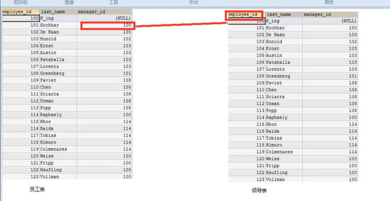
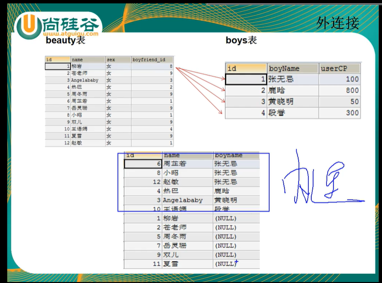
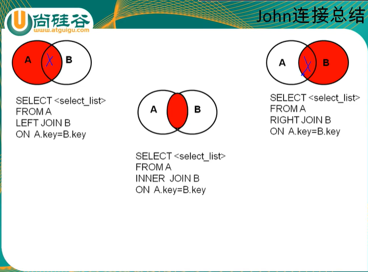
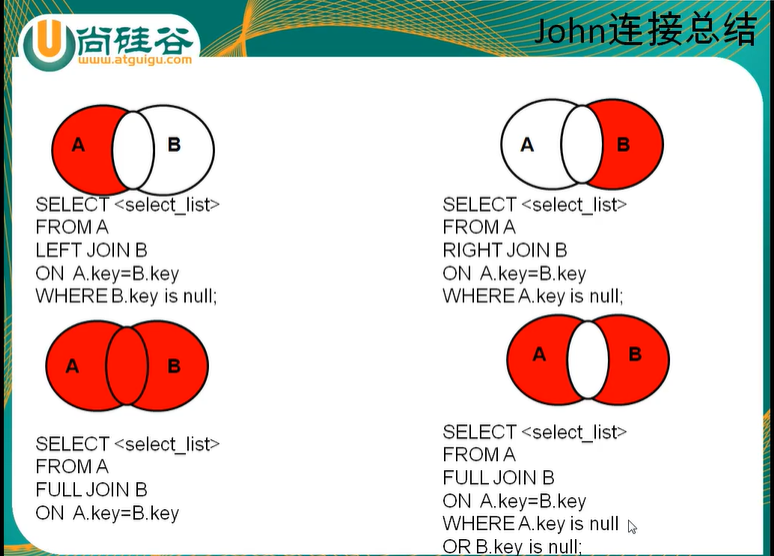

#  连接查询

+ 含意: 又称多表查询, 当查询的字段来自于多个表时, 就会用到连接查询

+ **笛卡尔乘积**现象: 表1 有m行, 表2 有n行, 结果 = m*n 行

  + 第一张表的记录挨个匹配第二张表

  + 原因: 没有有效的连接条件

  + 避免: 添加有效的连接条件

    

+ 分类: 

  + 按年代
    + sql92标准: 仅仅支持内连接
    + sql99标准[推荐]: 支持内连接 + 外连接(左外和右外) + 交叉连接
  + 按功能分类
    + 内连接:
      + 等值连接
      + 非等值连接
      + 自连接
    + 外连接: 
      + 左外连接
      + 右外连接
      + 全外连接(mysql不支持)
    + 交叉连接


## 一. sql92标准

#### 1.等值连接

+ 查询女名与其对应的男名

  ```
  SELECT name, boyName FROM boys, beauty
  WHERE bauty.boyfriend_id = boys.id
  ```

2. 为表起别名
   + 提高语句的简洁度
   + 区分多个重名的字段
   + 注意: 如果为表起了别名, 则查询的字段就不能使用原来的表名去限定
2. 总结: 
   + 多标等值连接的结果为多表的交集部分,
   + n表连接, 至少需要n-1个连接条件
   + 多表的顺序没有要求
   + 一般需要为表起别名
   + 可以搭配前面介绍的所有字句使用, 比如排序, 分组, 筛选....

#### 2. 非等值连接(大于/ 小于)

1. 查询员的工资和工资级别

   ```
   SELECT salary,grade_level
   FROM employees e, job_grades g
   WHERE salary BETWEEN g.`lowest_sal` AND g.`highest_sal`
   AND g.`grade_level` = 'A'
   ```

#### 3.自连接

+ 一张表当两张表



+ 例: 查询 员工名和上级的名称

  ```
  SELECT e.employes_id, e.last_name, m.employee_id, m.last_name
  FROM employees e, employees m
  WHERE e.`manager_id` = m.`employee_id`
  ```


## 二. sql99语法

### 1. 语法

+ SELECT 查询列表
+ FROM 表1 别名 [连接类型]
+ JOIN   表2  别名
+ ON 连接条件
+ [WHERE 筛选条件]
+ [GROUP BY 分组]
+ [HAVING 筛选条件]
+ [ORDER BY 排序列表]

### 2.分类

+ 内连接: inner
+ 外连接: 
  + 左外: left[outer]
  + 右外: right[outer]
  + 全外: full[outer] (mysql不支持)
+ 交叉连接: cross

#### ~内连接

+ 等值连接

  + 特点:

    + 添加排序, 分组, 筛选,...
    + inner可以省略
    + 表顺序可以调换
    + 筛选条件放在where后, 连接条件放在on 后, 提高分离性, 便于阅读
    + inner join 连接与sql92语法中的等值连接效果是一样的

  + 例:

    ```
    #查询员工名, 部门名, 工种名, 并按部门名排序
    SELECT last_name, department_name, job_title
    FROM employees e
    INNER JOIN departments d ON e.`department_id`=d.`department_id`
    INNER JOIN jobs j ON e.`job_id`=j.`job_id`
    ORDER BY department_name DESC
    ```

    与之前一样: n表连接需要 n-1个连接条件

    多表连接有顺序要求, 后面的表必须与前面的有连接条件

+ 非等值连接

  ```
  #查询工资级别的个数>20的个数, 并且按工资级别降序
  SELECT COUNT(*), grade_level
  FROM employees e
  JOIN job_grades g
  ON e.`salary` BETWEEN g.`lowest_sal` AND g.`highest_sal`
  HAVING COUNT(*)>20
  ORDER BY grade_level DESC;
  
  ```

+ 自连接

  ```
  #查询姓名中包含字符k的员工的名字, 上级的名字
  SELECT e.last_name, m.last_name
  FROM employees e
  INNER JOIN employees m
  ON e.`manager_id`=m.`employee_id`
  WHERE e.`last_name` 
  ```


#### ~外连接

+ 应用场景: 用于查询一个表中有, 另一个表中没有的记录

+ 特点:

  1. 外连接的查询结果为主表中的所有记录

     + 如果从表中有和呀他匹配的, 则显示匹配的值
     + 如果从表中没有和他匹配的,则显示null
     + 外连接查询结果 = 内连接结果 + 主表中有而从表中没有的记录

  2. 左外连接, left join 左边的是主表

     右外连接, right join 右边的是主表

  3. 左外和右外交换两个表的顺序, 可以实现同样的效果

+ 

+ 例:

```
#查询 男朋友 不在男表的女名
SELECT b.name,bo.*
FROM beauty b
LEFT OUTER JOIN boys bo
ON b.`boyfriend_id` = bo.`id`
WHERE bo.`id` IS NULL
```

+ 全外连接 = 内连接的结果 + 表1中有但表二中没有的 + 表二中有单表1没有的

#### ~交叉连接

```
SELECT b.*, bo.*
FROM beauty b
CROSS JOIN boys bo;
实现笛卡尔乘积
```


## 三.sql92 和sql99 对比

+ 功能: sql99 支持的较多
+ 可读性: sql99实现连接条件和筛选条件的分离, 可读性较高

+ 

+ 