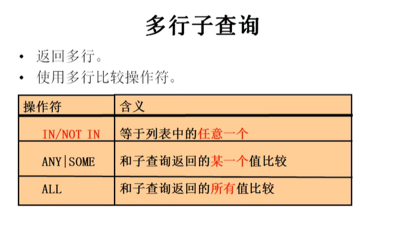

# 子查询

+ 含意: 
  + 出现在其他语句中的select语句, 称为子查询或内查询
  + 外部的查询语句,称为主查询或外查询
+ 分类:

1. 按子查询出现的位置:
   + select后面:
     + 仅仅支持标量子查询
   + from后面:
     + 支持表子查询
   + where或having后面:
     + **标量子查询**
     + **列子查询**
     + 行子查询
   + exists 后面(相关子查询)
     + 表子查询
   + join后面
2. 按结果集的行列数不同:
   + 标量子查询 (结果集只有一行一列)
   + 列子查询 (结果集只有一列多行)
   + 行子查询 (结果集有一行多列)
   + 表子查询 (结果集一般为多行多列)


## 1.where或having后面

1. 标量子查询 (单行子查询)
2. 列子查询 (多行子查询)
3. 行子查询 (多列多行)

+ 特点: 

  + 子查询放在小括号内

  + 子查询一般放在条件的右侧

  + 标量子查询, 一般搭配单行操作符使用

    <, >, >=, <=, =, <>
  
  + 列子查询, 一搭配着多行操作符使用
  
    IN, ANY/SOMY, ALL
  
  + 子查询的执行优先于主查询执行, 主查询的条件用到了子查询的结果

### ~1.标量子查询 (单行子查询)

+ 非法使用标量子查询: 

  + 单行操作符只能搭配标量子查询
  + 子查询结果必须为一行一列

+ 例: 

+ ```
  #返回job_id与141号员工相同, salary比143号员工多的员工, 姓名, job_id 和工资
  1. 查询141号员工的job_id
  SELECT job_id
  FROM employees
  WHERE employee_id = 141
  
  2. 查询143号员工的salary
  SELECT salary 
  FROM employees
  WHERE employee_id = 143
  
  3.查询员工的姓名, job_id 和工资, 要求job_id = 1. 并且salary>2.
  SELECT last_name, job_id, salary 
  FROM employees
  WHERE job_id = (
      SELECT job_id
      FROM employees
      WHERE employee_id = 141
  ) AND salary > (
  	SELECT salary 
      FROM employees
      WHERE employee_id = 143
  )
  ```

### ~2.列子查询 (多行子查询)



+ ANY|SOME与ALL不常用, 因为可以使用max()|min() 被 IN 替换
+ IN/NOT IN 也可以被 ANY|SOME 与ALL替换

```
案例1: 返回location_id是1400或1700的部门中的所有员工姓名
1. 查询location_id 是1400或1700的部门编号
SELECT DISTINCT department_id
FROM departments
WHERE location_id IN(1400, 1700)
2. 查询员工姓名, 要求部门号是1. 列表中的某一个
SELECT last_name
FROM employees
WHERE department_id IN(
    SELECT DISTINCT department_id
    FROM departments
    WHERE location_id IN(1400, 1700)
)


案例2: 返回其他部门中比job_id为`IT_PROG`部门任意工资低的员工的员工号, 姓名, job_id 以及salary
1. 查询job_id为`IT_PROG`部门任一工资
SELECT DISTINCT salary
FROM employees
WHERE job_id = `IT_PROG`
2. 查询员工号, 姓名, job_id 以及salary, salary<(1.)的任意一个
SELECT last_name, employee_id, job_id, salary
FROM employees
WHERE salary < ANY(
    SELECT DISTINCT salary
    FROM employees
    WHERE job_id = 'IT_PROG'
) AND job_id <> 'IT_PROG

或: 
SELECT last_name, employee_id, job_id, salary
FROM employees
WHERE salary <(
    SELECT MAX(salary)
    FROM employees
    WHERE job_id = 'IT_PROG'
) AND job_id <> 'IT_PROG

......
```

### ~3.行子查询 (结果集一行多列或多行多列)

+ 案例: 查询员工编号最小并且工资最高的员工信息

  ```
  #普通方法: 
  1.查询最小的员工编号
  SELECT NIN(employee_id)
  FROM employees
  2.查询最高工资
  SELECT MAX(salary)
  FROM employees
  3.查询员工信息
  SELECT * 
  FROM employees
  WHERE employee_id = (
  	SELECT NIN(employee_id)
  	FROM employees
  ) AND salary = (
      SELECT MAX(salary)
      FROM employees
  )
  
  #行子查询
  SELECT * 
  FROM employees
  WHERE (employee_id, salary) = (
  	 SELECT MAX(salary), MAX(sapary)
      FROM employees
  )
  ```

  

## 2.select后面

案例: 查询每个部门的员工个数

```
SELECT d.*, (
	SELECT COUNT(*)
	FROM employees e
	WHERE e.department_id = d.dempartment_id
)个数
```

## 3.from后面

+ 将子查询结果充当一张表, 要求必须起别名

+ 案例: 查询每个部门的平均工资的工资等级

  ```
  1. 查询每个部门的平均工资
  SELECT AVG(selary), department_id
  FROM employees
  GROUP BY department_id
  
  2. 连接1. 的结果集和job_grades表, 筛选条件平均工资
  SELECT ag_dep.*, g.`grade_level`
  FROM (
  	SELECT AVG(selary), department_id
      FROM employees
      GROUP BY department_id
  ) ag_dep
  INNER JOIN jov_grades g
  ON ag_dep.ag BETWEEN lowest_sal AND highest_sal;
  ```

  

## 4.exists后面(相关子查询)

+ 语法: exists (完整的查询语句) 
  + 结果: 1或0
+ 能用exists也能用in/not in 实现

+ 例: 查询有员工的部门名

  + ```
    SELECT department_name
    FROM depatrments d
    WHERE EXISTS(
    	SELECT *
    	FROM employees e
    	WHERE d.`department_id` = e.`department_id`
    )
    
    in: 
    SELECT department_name
    FROM departments d
    WHERE d.`department_id` IN(
    	SELECT department_id
    	FROM employees
    )
    ```

    