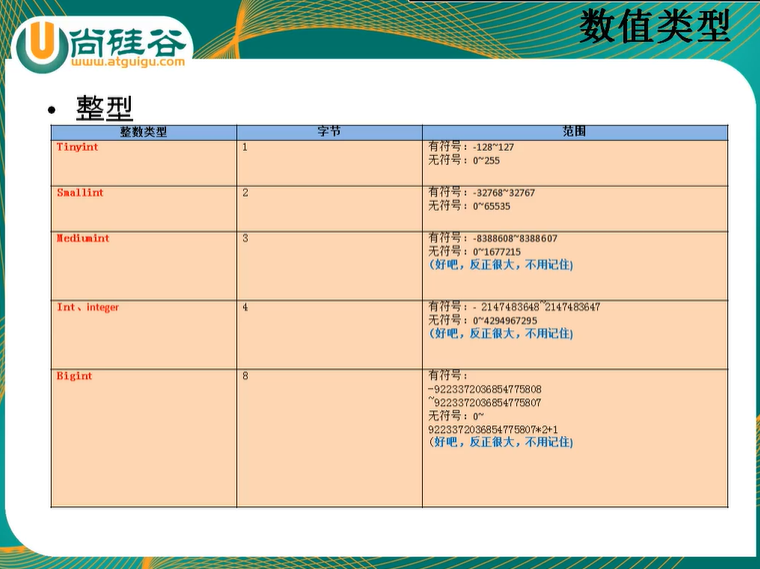

# 常见的数据类型

+ 数值型: 
  + 整形
  + 小数:
    + 定点数
    + 浮点数
+ 字符型:
  + 较短的文本: char, varchar
  + 较长的文本: text, blob (较长的二进制数据)
+ 日期型:

## 1.整形

+ 
+ 分类: 

| tinyint | smallint | mediumint | int/integer | bigint |
| :-----: | :------: | :-------: | :---------: | :----: |
|  1字节  |  2字节   |   3字节   |    4字节    | 8字节  |

+ 特点:
  + 如果不设置无符号还是有符号, 默认是有符号, 如果想设置无符号, 需要添加 unsigned 关键字
  + 如果插入的数值超出了整形的范围, 会报 out of range 异常, 并且(低版本sql会插入临界值)
  + 如果不设置长度, 会有默认的长度
+ 长度代表了显示的最大宽度而不是存入的大小,  如果不够用会用0在左边填充, 但必须搭配zerofill使用, 设置zerofill后,会设置为无符号!

## 2.小数

+ 分类: 
  + 浮点型:
    + float(M, D)
    + double(M, D)
  + 定点型
    + dec(M, D)
    + decimal(M, D)
+ 特点:
  + M: 整数部位 + 小数部位
  + D: 小数部位
  + 如果超过范围, 则插入临界值
  + 如果是decimal, 则M默认为10,  D默认为0
  + 如果是float和double, 则会根据插入的数值的精读来决定精读
  + 定点型的精读要求较高,  如果要求插入数值的精度较高如货币运算则考虑使用

+ 原则:
  + 所选择的类型越简单越好, 能保存数值的类型越小越好(节省空间)

## 3.字符型(串数据:文本型, 二进制)

+ 较短的文本: 

  + char(M) 	  
  + varchar(M) 

+ 较长的文本:

  + text
  + blob(较大的二进制)

+ 特点:

  + |         | 写法       | M的意思                        | 特点           | 空间的耗费 | 效率 |
    | ------- | ---------- | ------------------------------ | -------------- | ---------- | ---- |
    | char    | char(M)    | 最大的字符数,可以省略, 默认为1 | 固定长度的字符 | 比较耗费   | 高   |
    | varchar | varchar(M) | 最大的字符数, 不可省略         | 可变长度的字符 | 比较节省   | 第   |

+ 其他类型:
  + binary 和 varbinary 用于保存较短的二进制
  + enum用于保存枚举
  + set用于保存集合
+ 
+ 
+ 
+ 

## 4.日期型

+ 分类:

  + date只保存日期
  + time只保存时间
  + year只保存年
  + datetime 保存日期+年
  + timestamp保存日期+时间

+ 特点

  |           | 字节 | 范围      | 时区等的影响 |
  | --------- | ---- | --------- | ------------ |
  | datetime  | 8    | 1000-9999 | 不受         |
  | timestamp | 4    | 1970-2038 | 受           |

  

  

  